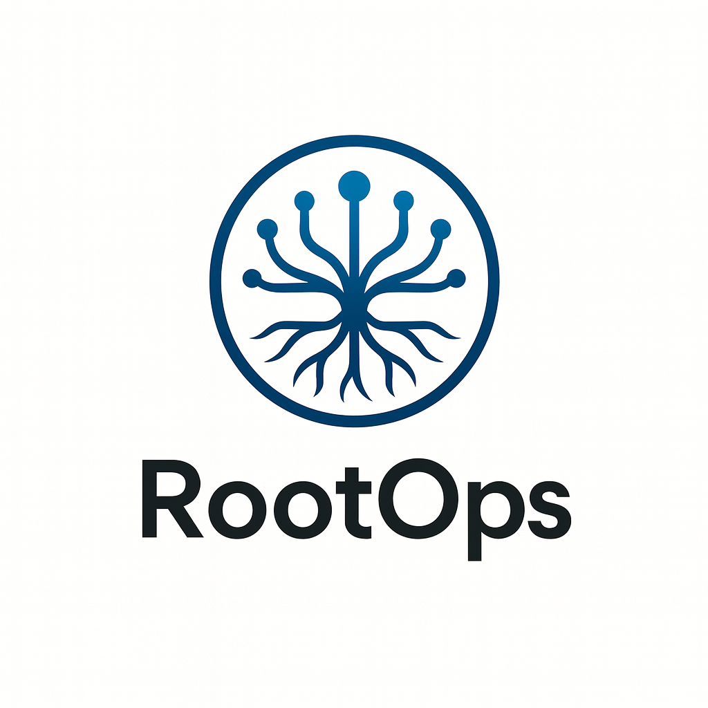

<div align="center">



*Code is everywhere. Understanding is not.*

**The developer intelligence platform that learns your system over time, running entirely on your infrastructure.**

[](LICENSE)
[](docker-compose.yml)
[](https://python.org)

[Quick Start](#quick-start) · [Features](#features) · [Architecture](#architecture) · [LLM Backends](#llm-backends) · [Configuration](#configuration) · [Contributing](#contributing)

</div>

---

## What is RootOps?

RootOps is a developer intelligence platform that sits alongside your entire engineering workflow. It ingests your Git repositories, application logs, and runtime events and builds a persistent, semantic understanding of your codebase, your services, and the people who build them.

On a normal day, engineers use it to search code in natural language, understand unfamiliar services, review pull requests with full codebase context, trace log errors back to the exact lines that produced them, and map who knows what across the team. The understanding accumulates over time into a causal knowledge graph that connects services, code, errors, and contributors — so the platform becomes more useful the longer it runs, not just during incidents.

It does all of this entirely on your own infrastructure. Your code, your logs, and your engineering history never leave your machine. That is a hard constraint that no cloud-based tool can match.

---

## Prerequisites

- [Docker](https://docs.docker.com/get-docker/) 24+ and [Docker Compose](https://docs.docker.com/compose/install/) v2
- **8 GB RAM** available for Docker (required by the default Llama 3 model via Ollama)
- Git

> If RAM is constrained, switch to a smaller Ollama model (e.g. `gemma3:2b`) by setting `OLLAMA_MODEL=gemma3:2b` in `.env`, or use a cloud backend (OpenAI, Anthropic) which has no local memory requirement.

---

## Quick Start

No source code required. Download the compose file and start:

```bash
curl -O https://raw.githubusercontent.com/theorjiugovictor/rootops/main/docker-compose.yml
curl -O https://raw.githubusercontent.com/theorjiugovictor/rootops/main/.env.example
cp .env.example .env
docker compose up -d
```

Docker pulls the pre-built images from GitHub Container Registry and starts all four services. Open **http://localhost:3000** when the containers are healthy.

The default configuration uses **Ollama** with Llama 3, free, fully local, no API key required.

> On first run, Ollama needs to download the Llama 3 model (~4 GB). Run `docker compose exec ollama ollama pull llama3` after startup, or use `make up` (see below) which handles this automatically.

### Using Make (recommended)

If you have the repository cloned, `make up` handles everything — pulls latest images, starts services, and downloads the LLM model:

```bash
git clone https://github.com/theorjiugovictor/rootops.git
cd rootops
make up
```

### Use a cloud LLM (optional)

Set your key and backend before running `make up`:

```bash
# OpenAI
export OPENAI_API_KEY=sk-...
echo -e "LLM_BACKEND=openai\nOPENAI_API_KEY=$OPENAI_API_KEY" >> .env

# Anthropic
export ANTHROPIC_API_KEY=sk-ant-...
echo -e "LLM_BACKEND=anthropic\nANTHROPIC_API_KEY=$ANTHROPIC_API_KEY" >> .env

# AWS Bedrock (picks up ~/.aws credentials automatically)
echo "LLM_BACKEND=bedrock" >> .env

make up
```

Or edit `.env` directly. See [LLM Backends](#llm-backends) for the full list of options.

### Ingest your first repository

1. Open the dashboard at **http://localhost:3000**
2. Navigate to **Settings**
3. Enter a local repository path or a Git URL
4. RootOps will chunk, embed, and index the codebase

The interactive API reference (Swagger UI) is available at **http://localhost:8000/docs**.

---

## Features

### Code Intelligence

**Natural language search:** Ask questions about your codebase in plain English. RootOps retrieves the most relevant code chunks using dense vector search, applies cross-encoder reranking for precision, and synthesises an answer with exact file and line references.

**Streaming Q&A:** Responses stream token-by-token via SSE. Conversation history is maintained across turns so follow-up questions retain full context.

**HyDE (Hypothetical Document Embedding):** Before embedding a query, RootOps asks the LLM to generate a hypothetical code answer, then searches code-to-code rather than text-to-code. This significantly improves retrieval accuracy on technical questions.

**Query planner:** Queries are classified by intent (diagnostic, architecture, impact, general) and routed to specialised retrieval strategies including parallel vector search across code and log domains.

### Repository Management

**Multi-repository ingestion:** Ingest any number of Git repositories, each tagged with a service name, team, and custom labels. Supports both local paths and remote Git URLs.

**Commit-level indexing:** Every commit is chunked, embedded, and stored with author, timestamp, and diff context so queries can reference historical changes.

**Dependency graph:** RootOps builds a cross-repository knowledge graph of service dependencies, causal relationships, and entity co-occurrences. Causal edges are promoted through confidence levels (observed > correlates_with > probable_cause > confirmed_cause) based on incident evidence and statistical analysis.

### Log Intelligence

**OTLP/HTTP receiver:** Accepts logs directly from OpenTelemetry SDKs and Collectors at the standard `POST /v1/logs` endpoint. No sidecar or agent required.

Point any OTel-compatible exporter at RootOps:

```yaml
# OpenTelemetry Collector config
exporters:
  otlphttp:
    endpoint: http://localhost:8000
    tls:
      insecure: true

service:
  pipelines:
    logs:
      exporters: [otlphttp]
```

**Raw log ingestion:** Paste or pipe raw log text through the dashboard or API. Logs are parsed, severity-filtered, deduplicated, and embedded into the same vector space as code.

**Log concept clustering:** Drain3-based log template clustering groups recurring log patterns into concepts with temporal histograms. Rising concepts (accelerating frequency) are surfaced proactively.

**Code correlation:** Log entries are matched to the source code that produced them using cosine similarity across the shared embedding space.

### Auto-Heal

**Error diagnosis:** RootOps diagnoses error logs by retrieving the most relevant code context and asking the LLM to identify the root cause.

**Fix generation:** For diagnosed issues above a confidence threshold, RootOps generates a corrected code snippet.

**PR creation:** Approved fixes are submitted as pull requests to GitHub automatically via the GitHub API. Requires a GitHub personal access token (`GITHUB_TOKEN`).

### Developer Profiles

**Contribution analytics:** Per-developer commit history is analysed to identify primary languages, file ownership, and contribution patterns.

**Expertise mapping:** Profiles are enriched by the LLM to produce a narrative summary of each developer's technical focus areas, useful for code review assignment and onboarding.

---

## Architecture

```
┌─────────────────────────────────────────────────────┐
│                     Next.js UI                       │
│            (Dashboard · App Router pages)            │
└───────────────────────┬─────────────────────────────┘
                        │ HTTP / SSE
┌───────────────────────▼─────────────────────────────┐
│                  FastAPI Backend                      │
│                                                       │
│  ┌─────────────┐  ┌────────────┐  ┌───────────────┐  │
│  │  RAG Engine │  │    Git     │  │  LLM Backend  │  │
│  │  + Reranker │  │  Ingestor  │  │  Dispatcher   │  │
│  └──────┬──────┘  └─────┬──────┘  └──┬───┬───┬───┘  │
│         │               │            │   │   │       │
│  ┌──────▼───────────────▼──┐      Ollama  │  OAI    │
│  │   PostgreSQL + pgvector  │    Bedrock  Anthropic  │
│  │   (embeddings + graph)   │                        │
│  └─────────────────────────┘                         │
└─────────────────────────────────────────────────────┘
```

**Components:**

| Component | Role |
|-----------|------|
| PostgreSQL + pgvector | Stores code chunks, commits, logs, embeddings, and knowledge graph edges |
| Sentence Transformers | Local embedding model (`jinaai/jina-embeddings-v2-base-code`, 768-dim, 8192-token context) |
| Cross-encoder reranker | Re-scores retrieval candidates for precision (`cross-encoder/ms-marco-MiniLM-L-6-v2`) |
| Ollama | Local LLM runtime, default backend (Llama 3) |
| FastAPI | Async API: RAG pipeline, ingestion, healing, profiles |
| Next.js | Developer dashboard (TypeScript, Tailwind CSS) |

---

## LLM Backends

Set `LLM_BACKEND` in `.env` to switch providers:

| Backend | `LLM_BACKEND` | API Key Required | Notes |
|---------|---------------|------------------|-------|
| **Ollama** (default) | `ollama` | No | Free, local, private. Bundled in Docker Compose. |
| **OpenAI** | `openai` | Yes (`OPENAI_API_KEY`) | GPT-4o, GPT-4o-mini, and others. |
| **Anthropic** | `anthropic` | Yes (`ANTHROPIC_API_KEY`) | Claude Sonnet, Haiku, Opus. |
| **AWS Bedrock** | `bedrock` | AWS credentials | Claude and Llama via AWS. Uses `~/.aws` automatically. |

---

## Configuration

All settings are environment variables. Copy `.env.example` to `.env` and edit as needed:

```bash
cp .env.example .env
```

| Variable | Default | Description |
|----------|---------|-------------|
| `LLM_BACKEND` | `ollama` | LLM provider: `ollama`, `openai`, `anthropic`, `bedrock` |
| `OLLAMA_MODEL` | `llama3` | Model name for Ollama |
| `OPENAI_API_KEY` | | OpenAI API key |
| `ANTHROPIC_API_KEY` | | Anthropic API key |
| `EMBEDDING_MODEL_NAME` | `jinaai/jina-embeddings-v2-base-code` | Sentence transformer model |
| `EMBEDDING_DIMENSION` | `768` | Must match the model's output dimension |
| `HYDE_ENABLED` | `true` | Enable Hypothetical Document Embedding |
| `RERANKER_ENABLED` | `true` | Enable cross-encoder reranking |
| `POSTGRES_DB` | `rootops` | Database name |
| `GITHUB_TOKEN` | | GitHub PAT for Auto-Heal PR creation |
| `API_PORT` | `8000` | API port |
| `WEB_PORT` | `3000` | Dashboard port |

See [.env.example](.env.example) for the full list with documentation.

---

## Development

### Make commands

```bash
make help             # List all available commands
make up               # Pull latest images, start all services, pull LLM model
make dev              # Build from source with hot-reload (contributors)
make down             # Stop all services
make logs             # Tail all service logs
make logs-api         # Tail API logs only
make logs-web         # Tail Web UI logs only
make pull-model       # Pull or update the configured Ollama model
make pull-embeddings  # Pre-download the embedding model to host cache (~600 MB)
make build            # Rebuild source images
make clean            # Stop and remove all volumes (deletes all data)
```

### Running without Docker

```bash
# Start PostgreSQL and Ollama only
docker compose up -d db ollama

# Run the API with hot-reload
cd api
curl -LsSf https://astral.sh/uv/install.sh | sh
uv sync
uv run uvicorn app.main:app --reload --port 8000

# Run the web UI
cd web
npm install
npm run dev
```

### Tests

```bash
cd api && python -m pytest tests/ -v
```

---

## Deployment

Docker Compose is the recommended deployment method:

```bash
docker compose up -d
```

RootOps runs anywhere Docker is available:

- **Railway / Render:** deploy each service independently
- **AWS ECS / GCP Cloud Run:** containerised deployment
- **Kubernetes:** use the Docker images with your own manifests

The only hard infrastructure requirement is **PostgreSQL with the pgvector extension**.

---

## Roadmap

- [ ] GitLab and Bitbucket integration
- [ ] Webhook-based real-time ingestion
- [ ] Custom embedding model support
- [ ] Plugin system for custom analyses
- [ ] VS Code extension
- [ ] Slack and Teams notifications

---

## Security

To report a vulnerability, please see [SECURITY.md](SECURITY.md). We follow responsible disclosure and aim to respond within 72 hours.

## Contributing

Contributions are welcome. See [CONTRIBUTING.md](CONTRIBUTING.md) for guidelines.

## License

Apache License 2.0. See [LICENSE](LICENSE) for details.

---

<div align="center">

Built by engineers, for engineers.

[Star on GitHub](https://github.com/rootops-dev/rootops-v3) · [Documentation](docs/) · [Report a Bug](https://github.com/rootops-dev/rootops-v3/issues)

</div>
